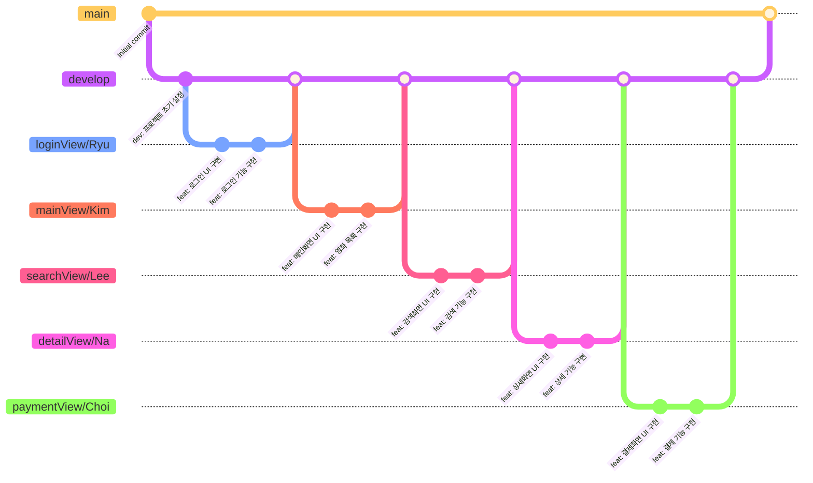

# 🎬 영화 예매 앱 프로젝트 6GV

> 6GV는 영화상영정보안내 및 예매 모바일 앱 입니다.
---
<p align="left">
  
</p>

## 📌 프로젝트 소개

회원가입 후 로그인하여 영화상영 정보를 알 수 있고 </p>
예매 할 수 있는 모바일 앱 프로젝트입니다.

- [6GV 프로젝트 대시보드](https://www.notion.so/teamsparta/b4e2e05664d247489c579dbc894d6589)

### 대상 사용자

- 😎 영화를 손쉽게 예매하고 싶은 사람
- 🍿 영화 상영 정보가 궁금한 사람

---


## 👥 팀 구성
| Name      | 역할       | GitHub                           |
| -------- | -------- | --------------------------------- |
| Ryu  | 로그인/회원가입 | [@taeryu7](https://github.com/taeryu7) |
| Kim  | 메인화면 | [@nemo-semo](https://github.com/nemo-semo) |
| Lee | 검색기능 | [@jwl-98](https://github.com/jwl-98) |
| Choi | 예매화면 | [@Choi-jun08](https://github.com/Choi-jun08) |
| Na  | 상세화면, API연결 | [@bryjna07](https://github.com/bryjna07) |

---

## ⏰ 프로젝트 일정

- **시작일**: 24/12/13  
- **종료일**: 24/12/20

---

## 🛠️ 기술 스택

### UI Frameworks
- UIKit
- AutoLayout

### 데이터 처리
- UserDefaults

### API 통신
- Alamofire

### 활용 API
- The Movie Database(TMDB) API

### 📝 Technologies & Tools

<p> <!-- Swift -->  <!-- UIKit -->  <!-- UserDefaults -->  <!-- Alamofire -->  <!-- GitHub -->  <!-- Figma -->  <!-- Notion -->  <!-- Slack -->  </p>

---

## 📱 주요 기능

1. **영화정보 안내**

   현재 상영중, 개봉예정, 인기있는 영화의 목록 및 영화정보가 제공됩니다. 

2. **로그인/회원정보 및 마이페이지**

   회원가입 기능을 통해 사용자 본인의 정보 및 예매내역을 확인할 수 있습니다.

3. **영화 검색**

   사용자가 찾고싶은 영화를 검색할 수 있습니다.

---

## 🌿 Git Flow


## 📋 브랜치 전략
- `main`: 제품 출시 브랜치
- `develop`: 개발 브랜치
- `*View/*`: 기능 개발 브랜치

## 💻 Commit Convention

### 1. 커밋 메시지 구조
```
type: subject

body

```

### 2. Commit Type
| Type | Description |
|------|-------------|
| feat | 새로운 기능 추가 |
| fix | 버그 수정 |
| docs | 문서 수정 |
| style | 코드 포맷팅, 세미콜론 누락, 코드 변경이 없는 경우 |
| refactor | 코드 리펙토링 |
| test | 테스트 코드, 리펙토링 테스트 코드 추가 |
| chore | 빌드 업무 수정, 패키지 매니저 수정 |
| cmt | 주석 수정 |

### 3. Subject (제목)
- 최대 50글자
- 마침표 및 특수기호 사용 X
- 과거 시제 사용 X
- 개조식 구문으로 작성


### 4. Body (본문)
- 한 줄당 72자 이내
- 상세한 설명 (무엇을, 왜 변경했는지)


### 6. 커밋 예시
```
feat: 회원 가입 기능 구현

SMS, 이메일 중복확인 API 개발

```

---

## 📦 설치 및 실행 방법

 이 저장소를 클론합니다:
   ```bash
   git clone https://github.com/jwl-98/ios5-movie.git
