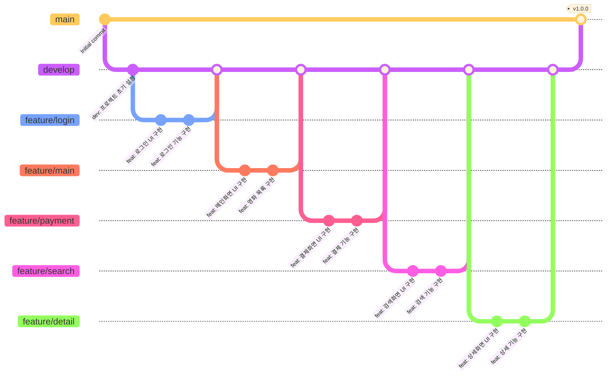

# 🎬 영화 예매 앱 프로젝트

## 📌 프로젝트 소개
영화 예매 모바일 앱 프로젝트입니다.

## 👥 팀 구성
- **Ryu**: 로그인/회원가입
- **Kim**: 메인 화면
- **Lee**: 결제 시스템
- **Choi**: 검색 기능
- **Na**: 상세 페이지

## 🌿 Git Flow


## 📋 브랜치 전략
- `main`: 제품 출시 브랜치
- `develop`: 개발 브랜치
- `feature/*`: 기능 개발 브랜치

## 💻 Commit Convention

### 1. 커밋 메시지 구조
```
type: subject

body

footer
```

### 2. Commit Type
| Type | Description |
|------|-------------|
| feat | 새로운 기능 추가 |
| fix | 버그 수정 |
| docs | 문서 수정 |
| style | 코드 포맷팅, 세미콜론 누락, 코드 변경이 없는 경우 |
| refactor | 코드 리펙토링 |
| test | 테스트 코드, 리펙토링 테스트 코드 추가 |
| chore | 빌드 업무 수정, 패키지 매니저 수정 |
| cmt | 주석 수정 |

### 3. Subject (제목)
- 최대 50글자
- 마침표 및 특수기호 사용 X
- 영문 사용 시 첫 글자 대문자로 시작
- 과거 시제 사용 X
- 개조식 구문으로 작성

예) `Add` (O) / `Added` (X)

### 4. Body (본문)
- 한 줄당 72자 이내
- 상세한 설명 (무엇을, 왜 변경했는지)

### 5. Footer (꼬리말)
이슈 트래커 ID 작성
- `Fixes`: 이슈 수정중
- `Resolves`: 이슈 해결
- `Ref`: 참고 이슈
- `Related to`: 관련 이슈

예) `Fixes: #45 Related to: #34, #23`

### 6. 커밋 예시
```
Feat: "회원 가입 기능 구현"

SMS, 이메일 중복확인 API 개발

Resolves: #123
Ref: #456
Related to: #48, #45
```

## 🚀 시작하기

### 저장소 클론
```bash
git clone [repository URL]
cd [repository name]
```

### 브랜치 생성
```bash
git checkout -b feature/[기능명]
```

### 개발 완료 후 머지 요청
1. 개발 브랜치에서 작업 완료
2. develop 브랜치로 Pull Request 생성
3. 코드 리뷰 후 승인되면 머지
